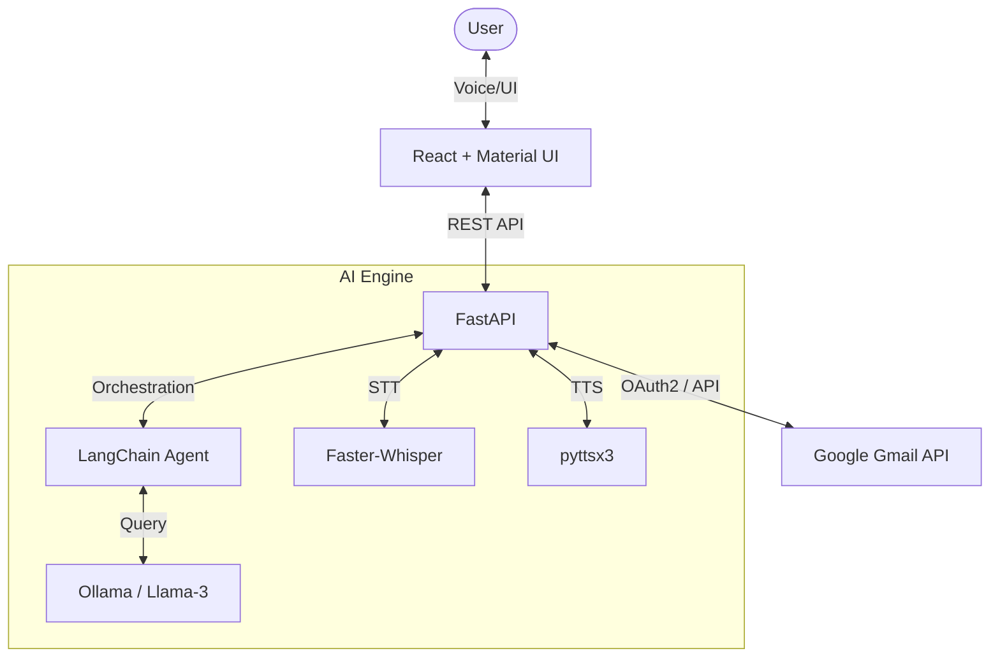

# Smartmail - AI-Powered Voice Controlled Email Assistant

Smartmail is a sophisticated email management system that leverages Artificial Intelligence and Voice Recognition to provide a hands-free, agentic experience for managing your Gmail inbox. It combines modern web technologies with local LLMs to interpret natural language commands and execute complex email operations.

## 🏗️ System Architecture

Smartmail follows a decoupled architecture consisting of a React-based frontend and a FastAPI-based backend, orchestrated by a LangChain agent.



### Component Flow

1.  **Interaction**: The user interacts via voice or the dashboard.
2.  **Recognition**: Voice input is processed using **Faster-Whisper** for high-accuracy Speech-to-Text.
3.  **Interpretation**: The text command is sent to the **LangChain Agent**, which uses **Llama-3 (via Ollama)** to interpret the user's intent.
4.  **Execution**: The agent decides which tools to use (e.g., `fetch_unread_emails`, `archive_email`, `search_emails`) to interact with the **Gmail API**.
5.  **Feedback**: The system provides visual updates in the React UI and audio feedback using **pyttsx3** (Text-to-Speech).

---

## 🛠️ Tech Stack

### Frontend

- **React 18**: Component-based UI library.
- **TypeScript**: Type-safe JavaScript for robust development.
- **Material UI (MUI) v5**: Premium UI components and design system.
- **Axios**: For seamless API communication with the backend.
- **React Router v6**: Client-side routing.

### Backend

- **FastAPI**: High-performance Python web framework.
- **LangChain**: Framework for building LLM-powered agentic workflows.
- **Google API Client**: Integration with Gmail services via OAuth2.
- **Uvicorn**: ASGI server for running FastAPI.

---

## 🤖 LLM & AI Models

Smartmail integrates several state-of-the-art models to provide its intelligent experience:

### 1. Large Language Model: Llama-3 (via Ollama)

- **Purpose**: The "brain" of the system. It handles NLU (Natural Language Understanding) to parse vague voice commands into structured actions.
- **Integration**: Hosted locally via **Ollama**, ensuring privacy and low latency.
- **Usage**: Utilized within a ReAct agent loop in LangChain to reason about which email tools to invoke.

### 2. Speech-to-Text: Faster-Whisper

- **Purpose**: Converts user speech into text.
- **Capabilities**: Uses a re-implemented version of OpenAI's Whisper model, providing significant performance improvements and accuracy for real-time applications.

### 3. Text-to-Speech: pyttsx3

- **Purpose**: Converts system responses back into spoken audio.
- **Features**: Utilizes native platform drivers (SAPI5 on Windows) for offline text-to-speech synthesis.

---

## ✨ Key Features

- **Voice Dashboard**: Visual representation of your inbox with voice visualizers.
- **Agentic Search**: Natural language search (e.g., _"Find the email from Aditi about the project architecture"_).
- **Email Management**: Voice commands for:
  - Reading email bodies/summaries.
  - Archiving and Unarchiving.
  - Deleting emails.
  - Starring/Marking as Important.
  - Switching between tabs (Inbox, Social, Promotions).
- **Secure Authentication**: Google OAuth2 integration for secure access to Gmail.

---

## 🚀 Getting Started

### Prerequisites

- Python 3.10+
- Node.js & npm
- [Ollama](https://ollama.com/) installed and running `llama3`.
- Google Cloud Console Project with Gmail API enabled.

### Setup

1.  **Backend**:
    ```bash
    cd Smartmail/backend
    pip install -r requirements.txt
    python app.py
    ```
2.  **Frontend**:
    ```bash
    cd Smartmail/frontend
    npm install
    npm start
    ```

Check the `run_smartmail.bat` in the root for a quick-start script.
